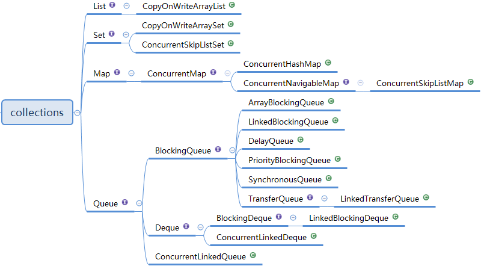

## Java重要知识点备忘

* concurrent 并发包

    * 线程池
         1. newFixedThreadPool和newSingleThreadExecutor:
             * 主要问题是堆积的请求处理队列可能会耗费非常大的内存，甚至OOM。
         2. newCachedThreadPool和newScheduledThreadPool:
             * 主要问题是线程数最大数是Integer.MAX_VALUE，可能会创建数量非常多的线程，甚至OOM。
    * Lock 
        - 公平锁模式下，的tryLock也是非公平的
* container 容器
    * 非并发容器
    * 并发容器
    
        
        * CopyOnWrite
* future
