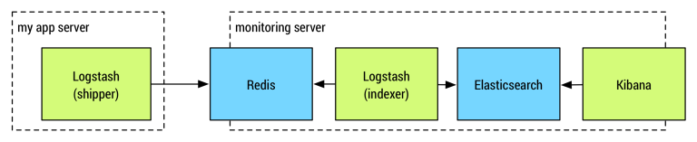

## 自定义机制
1. 为了快速定位问题二引入的 **requestId**
    
    generateRequestId=groupId+atomicLong.getAndIncrement()+getInternalIpLastPart()
    
2. 通过java的SPI机制，扩展dubbo的filter，传递 requestId
3. filter实现自定义异常和返回值的传递
4. 自定义HandlerMapping中的urlPathHelper，实现URL动态，缩小苹果审核黑名单影响
5. 自定义PermissionAnnotation，控制接口访问权限，在自定义的HandlerAdapter中做统一验证
6. 自定义ChannelInfo的Annotation，控制哪些参数要暴露给Android客户端，还可以扩展注解功能，控制每个参数的合法性，在web页面提交的时候做参数合法性验证。
7. 通过Java的内省Introspector，动态把web中input标签的值设置到对应的bean对象上

## 可能存在的问题
1. 线程池的使用方式，跟直接new cup个线程没有区别
2. sql缓存的使用对源码的侵入性太强，可以通过实现Mybatis的Cache接口来实现
    
    可以直接使用 Mybatis3 官方提供的 Cache 包
    1. 非强依赖性 -- 查不到会去数据库中查询
    2. 集群的同步性 -- 依赖 timeout 设置 Redis 中的 ttl，这样只会有一个服务器来更新
    3. 灵活性 -- 可以在 namespace 中的指定 sql 中关闭二级缓存的使用
    
3. 定时刷新数据库缓存的线程，为了能够在集群中单机执行，使用了配置固定IP的策略，
这样会存在单点问题（当然我们的业务，这个并不重要），可以使用分布式锁优化，
比如zookeeper的 临时类型的znode节点来实现

## 指标
1. nginx 每日大约 四千万 访问
2. DAU 约一百万
3. 

## 需要继续深入了解的地方
1. Druid SQL统计的实现

    因为是多服务器，所以用到了Zookeeper的目录，存放各个服务器的host和port。
    通过JMX下载 Druid Monitor 界面最后的 JSON API 中的 datasource.json 文件，并解析、存库、统计
    
2. Nginx 统计实现（多种方式的演变：https://www.cnblogs.com/aresxin/p/8035137.html，搭建：https://www.cnblogs.com/kevingrace/p/5919021.html）

    通过 elasticsearch 收集日志，具体的收集细节和 ES 的接口和使用方式
    * logstash 分为 shipper 和 indexer。
    * shipper input读取日志后，filter过滤，再通过Redis通道output，发送出去。
    * indexer 收集由多台shipper发送的日志，一般会把Redis安装到此主机，收到日志后发送给本机的elasticsearch
    

3. 异常监控
    
    全局异常处理类里面，把异常信息存库
    
4. 脚本中关于JVM参数的精通 
5. 日志为什么要发送到 log_server 

    1、部分日志需要存库，这里批量插入，避免影响业务，2、BI、热云等报送也走这里。
6. 