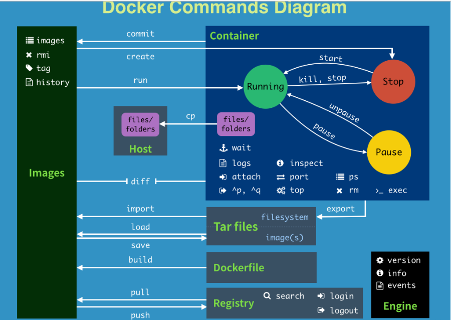

## 常用命令
* attach    Attach to a running container                 # 当前 shell 下 attach 连接指定运行镜像
* build     Build an image from a Dockerfile              # 通过 Dockerfile 定制镜像
* commit    Create a new image from a container changes   # 提交当前容器为新的镜像
* cp        Copy files/folders from the containers filesystem to the host path   #从容器中拷贝指定文件或者目录到宿主机中
* create    Create a new container                        # 创建一个新的容器，同 run，但不启动容器
* diff      Inspect changes on a container's filesystem   # 查看 docker 容器变化
* events    Get real time events from the server          # 从 docker 服务获取容器实时事件
* exec      Run a command in an existing container        # 在已存在的容器上运行命令
* export    Stream the contents of a container as a tar archive   # 导出容器的内容流作为一个 tar 归档文件[对应 import ]
* history   Show the history of an image                  # 展示一个镜像形成历史
* images    List images                                   # 列出系统当前镜像
* import    Create a new filesystem image from the contents of a tarball # 从tar包中的内容创建一个新的文件系统映像[对应export]
* info      Display system-wide information               # 显示系统相关信息
* inspect   Return low-level information on a container   # 查看容器详细信息
* kill      Kill a running container                      # kill 指定 docker 容器
* load      Load an image from a tar archive              # 从一个 tar 包中加载一个镜像[对应 save]
* login     Register or Login to the docker registry server    # 注册或者登陆一个 docker 源服务器
* logout    Log out from a Docker registry server          # 从当前 Docker registry 退出
* logs      Fetch the logs of a container                 # 输出当前容器日志信息
* port      Lookup the public-facing port which is NAT-ed to PRIVATE_PORT    # 查看映射端口对应的容器内部源端口
* pause     Pause all processes within a container        # 暂停容器
* ps        List containers                               # 列出容器列表
* pull      Pull an image or a repository from the docker registry server   # 从docker镜像源服务器拉取指定镜像或者库镜像
* push      Push an image or a repository to the docker registry server    # 推送指定镜像或者库镜像至docker源服务器
* restart   Restart a running container                   # 重启运行的容器
* rm        Remove one or more containers                 # 移除一个或者多个容器
* rmi       Remove one or more images             # 移除一个或多个镜像[无容器使用该镜像才可删除，否则需删除相关容器才可继续或 -f 强制删除]
* run       Run a command in a new container              # 创建一个新的容器并运行一个命令
* save      Save an image to a tar archive                # 保存一个镜像为一个 tar 包[对应 load]
* search    Search for an image on the Docker Hub         # 在 docker hub 中搜索镜像
* start     Start a stopped containers                    # 启动容器
* stop      Stop a running containers                     # 停止容器
* tag       Tag an image into a repository                # 给源中镜像打标签
* top       Lookup the running processes of a container   # 查看容器中运行的进程信息
* unpause   Unpause a paused container                    # 取消暂停容器
* version   Show the docker version information           # 查看 docker 版本号
* wait      Block until a container stops, then print its exit code   # 截取容器停止时的退出状态值
